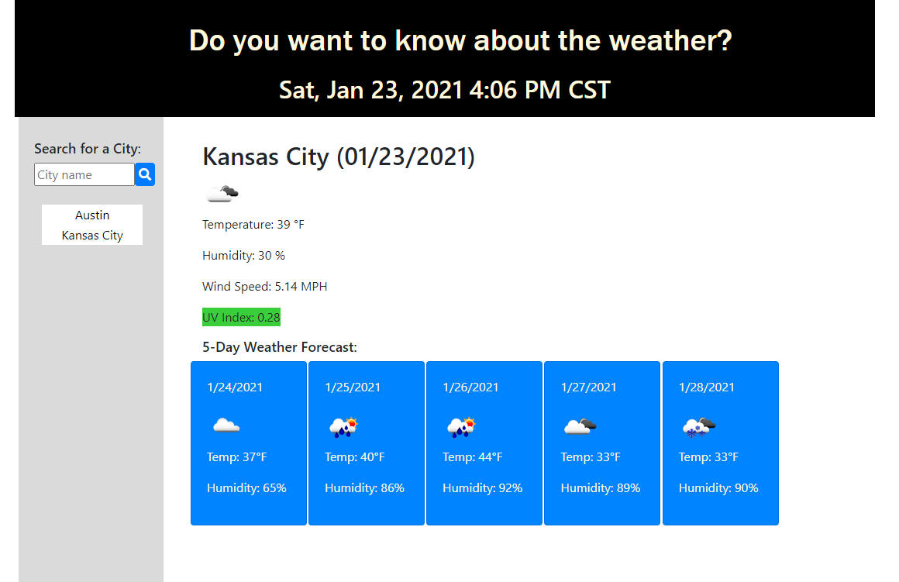
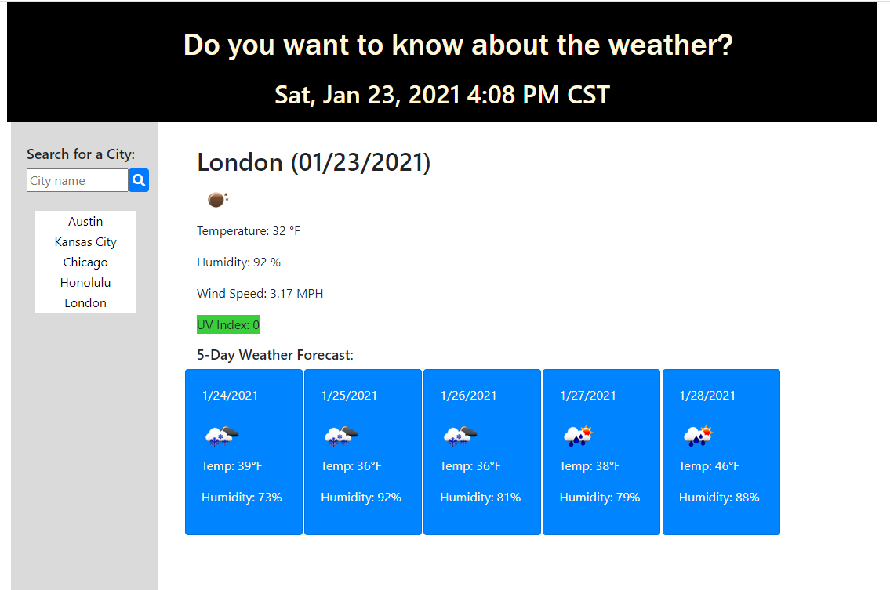
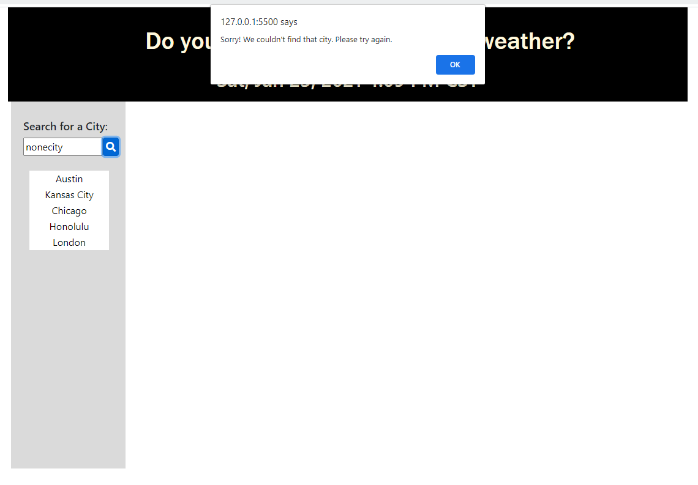

# WEATHER DASHBOARD

## DESCRIPTION

This webpage was designed to show the weather for a city the user would like to search for.

The current time is shown as well as a search box. Once a city is searched, the city is then saved to the side to be accessed later. The last city searched will appear when the page is visited again.

When a city is searched, the user is shown the following items: The city name, the date, an icon showing weather conditions, temperature, humidiy, wind speed, UV index, and weather conditions for the next 5 days.

## WHAT WAS DONE?

Most of the elements are added dynamically in the javascript document. The html document contains the bones. 

A clock is displayed with a time interval showing the exact time at the top of the document. 

Local storage is used to retrieve any previous data the user has searched for including search history buttons and the last city searched, so it may be displayed when the page is reloaded.

The function used to get the weather will be called 3 different ways. The first is when a user searched for a city. The second is when the user has a saved city in their history (the function will be called automatically upon loading the page) and the third is when the user clicks a city button. 

AJAX is used to retrieve city weather details from openweathermap.org. the city name is used in the first search, which then returns latitude and longitude coordinates to call the rest of the information (such as UV index and 5 day forecast).

## DEPLOYED!

This project was successfully deployed, Need proof? Click the links below to give it a try.

[Weather Dashboard](https://cmoss703.github.io/weather-dashboard/)

[Github Repo](https://github.com/cmoss703/weather-dashboard)

## PROOF

See some images of the page in action below:

